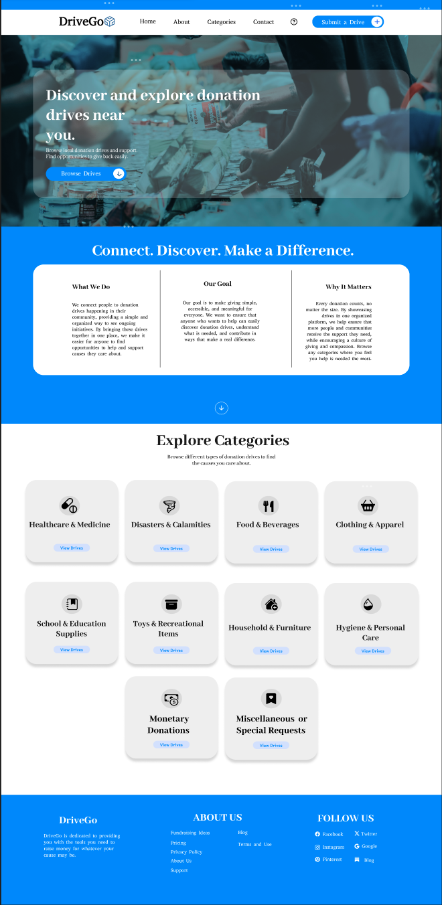
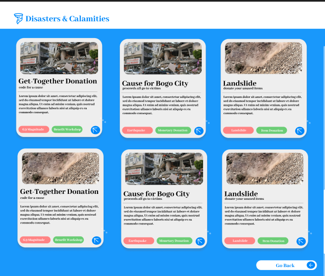

# DriveGo – Centralized Donation Drive for Cebu
---
## Features
- **Centralized Donation Drives**: All donation opportunities across Cebu are showcased in one place, making it easier for users to find and contribute.  
- **Multiple Categories**: Donation drives are grouped into a variety of categories, including:
  - Healthcare & Medicine  
  - Disasters & Calamities  
  - Food & Beverages  
  - Clothing & Apparel  
  - School & Education Supplies  
  - Toys & Recreational Items  
  - Household & Furniture  
  - Hygiene & Personal Care  
  - Monetary Donations  
  - Miscellaneous or Special Requests  
- **Category Cards & Icons**: Each category is represented by visually intuitive icons sourced from [Bootstrap Icons](https://icons.getbootstrap.com/), providing a clean and consistent user interface.  
- **Submit a Drive**: Users can submit their own drives using the built-in form, making community contributions easy and streamlined.  
- **Node.js Backend**: DriveGo uses Node.js to handle form submissions and server-side logic without requiring a full database setup.  

---

## Screenshots

  

  

---

## How It Works

1. **Browse Drives**: Users can explore donation drives by category or search for specific initiatives.  
2. **Submit Drives**: Community members can easily submit their drives via the modal form.  
3. **Contribute**: Once a drive is selected, users can directly contribute items, services, or monetary donations.  

---

DriveGo simplifies giving by making it accessible, transparent, and centralized for the entire Cebu community.
